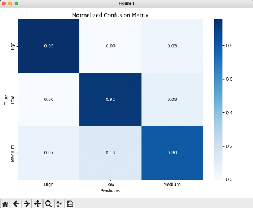
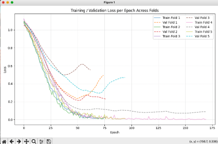

# Machine Learning Model

This directory contains the Python code to train and evaluate the task priorisation model found in the watchOS application.

## Contents

## Overview

## Model evaluation

Performance of the model was evaluated by using techniques such as confusion matrixes and training curves seen in the screenshots below. The confusion matrix highlights the models strong performance in low to high classified tasks, with most misclassifcation found in borderline medium priority classes.

  
  

