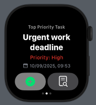
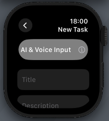
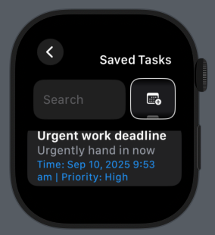
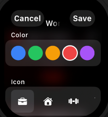

# Task-Manager-WatchOS-app

AI-Assisted Task Manager application designed and built for the Apple Watch with SwiftUI. This applicaiton eables users to create, manage, and prioritise tasks directly from their Apple Watch. The app integrates **on-device machine learning** to intelligently rank tasks by its priority based on contextual data, while maintaing a lightweight, responsive UI that addresses the usability constraints from a wearable device.

## Key Features
- Task creation, viewing, and editing using a SwiftUI interface
- Voice input support with Natural Language processing for task details
- On-device task priortisation, via a Python ML model converted to CoreML
- Local presistence via JSON encoding
- Focus mode and configurable themes
- Designed to address the usability constraints found through WatchOS

## Screenshots

  
  
  

  
  

## Architecture & Design
The following architecture follows a clear seperation of responsibilites inspired by the MVVM principles:
- **Views:** SwiftUI views handle all the UI rendering and state changes
- **Models:** Models created in Python are converted to CoreML
- **Logic:** CoreML prediction handled by a dedicated preditor class, Voice input parsing and feature extraction isolated from UI logic.

## Machine Learning & AI Integration:
- ML models are trained in Python and deployed using CoreML
- Feature encoding coverts task metadata into model ready inputs
- Predictions performed locally on device, avoiding user privacy and latency constraints

## Tech Stack
- SwiftUI
- Watchos
- CoreML
- NaturalLanguage
- Python
- PyTorch
- JSON presistence

## Academic Context
This project was originally developed as part of my **MSc Advanced Computer Science** dissertation. The code and documentation found here has been adapted and cleaned up for portfolio use.

## License
This project is provided for portfolio and educational purposes.
